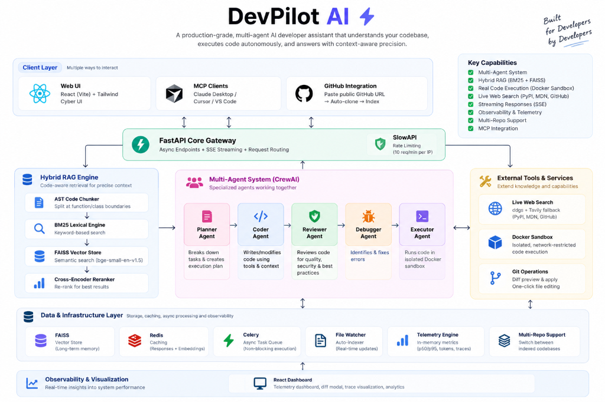
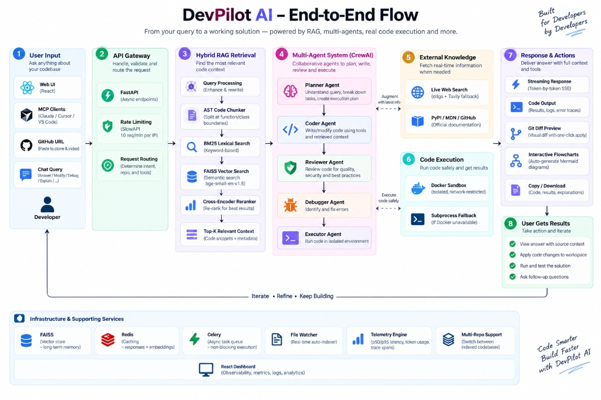

<div align="center">

# ⚡ DevPilot AI

**A production-grade, multi-agent AI developer assistant that understands your codebase,**  
**executes code autonomously, and answers with context-aware precision.**

---

[](https://fastapi.tiangolo.com)
[](https://python.org)
[](https://github.com/facebookresearch/faiss)
[](https://crewai.com)
[](https://reactjs.org)
[](https://redis.io)
[](https://docs.celeryq.dev)
[](LICENSE)

</div>

---

## 🧠 What is DevPilot AI?

DevPilot AI is a **fully autonomous developer assistant** powered by a pipeline of specialized agents (Planner, Coder, Reviewer, Debugger, Executor), a hybrid RAG engine (BM25 + FAISS + Cross-Encoder), and a sandboxed execution environment.

> Think of it as having a senior dev, a code reviewer, and a QA engineer available 24/7, all knowing your codebase inside-out.

---

## 🏗️ System Architecture

<p align="center">
  
</p>

---

## 🔄 End-to-End Execution Flow

<p align="center">
  
</p>

---

## ✨ Features at a Glance

| Feature | Description |
|---|---|
| 🔍 **Hybrid RAG Pipeline** | BM25 + FAISS (Cosine FlatIP) + Reciprocal Rank Fusion (RRF) + Cross-Encoder reranking |
| 🤖 **Multi-Agent System** | Dynamic CrewAI pipeline (Planner → Coder → Reviewer → Debugger → Executor) |
| ⚡ **Async Code Execution** | Non-blocking **Celery + Redis** task queue running code in isolated Docker sandboxes |
| 🎨 **Git Diff & One-Click Apply** | Visual unified git diff preview modal with direct workspace file editing |
| 📊 **Observability & Telemetry** | Real-time p50/p95 latency metrics, token usage, log streams, and interactive React dashboard |
| 🌐 **Live Web Search** | Real-time external documentation lookup (PyPI, MDN, GitHub) via `ddgs` & Tavily fallback |
| 📈 **RAG Evaluation Suite** | Automated benchmark measuring **Hit Rate@K**, **MRR**, and **Context Precision** |
| 🌊 **Streaming Responses** | Token-by-token SSE streaming across all endpoints |
| 🔌 **MCP Integration** | Native Model Context Protocol server for Claude Desktop, Cursor & VS Code |
| 📦 **Multi-Repo Support** | Instant switching between local repositories & one-click public GitHub repo cloning |
| 🌳 **AST Code Chunking** | Intelligent splitting at function/class boundaries for Python codebases |

---

## 🚀 Quick Start

### 🐳 Docker Compose (Recommended)

To spin up the entire system (FastAPI backend, Redis, Celery worker, and React UI) in a single command:

```bash
# 1. Clone repository & set up environment
git clone https://github.com/harshitgangwar/devpilot-ai.git
cd devpilot-ai
cp .env.example .env

# 2. Launch all services
docker-compose up --build
```

- **Web UI**: [http://localhost:5173](http://localhost:5173)
- **FastAPI API**: [http://localhost:8000](http://localhost:8000)

---

### 💻 Manual Setup

```bash
# 1. Set up virtual environment & install requirements
python -m venv venv
source venv/bin/activate   # On Windows: venv\Scripts\activate
pip install -r requirements.txt

# 2. Configure environment
cp .env.example .env       # Add your OPENROUTER_API_KEY

# 3. Start Redis (optional, for caching & async execution)
docker run -d -p 6379:6379 redis:alpine

# 4. Launch backend server
uvicorn app.main:app --reload

# 5. Start React UI
cd ui && npm install && npm run dev
```

---

## 🔌 API & MCP Integration

### Core API Endpoints

| Method | Endpoint | Description |
|---|---|---|
| `POST` | `/upload-repo` | Index a local repository path |
| `POST` | `/upload-github` | Clone & index a public GitHub repo URL |
| `POST` | `/ask/stream` | Ask a question about codebase (SSE stream) |
| `POST` | `/agent/run` | Execute an autonomous multi-agent task |
| `GET` | `/api/observability/overview` | Real-time telemetry metrics summary |

### MCP Integration (Claude Desktop / Cursor / VS Code)

Add to your `claude_desktop_config.json`:

```json
{
  "mcpServers": {
    "devpilot-ai": {
      "command": "/path/to/venv/bin/python",
      "args": ["-m", "app.mcp.server"],
      "cwd": "/path/to/devpilot-ai",
      "env": {
        "PYTHONPATH": "/path/to/devpilot-ai"
      }
    }
  }
}
```

---

## 📈 RAG Evaluation Benchmark

Run quantitative retrieval benchmarks via `tests/eval_rag.py`:

```bash
python3 tests/eval_rag.py
```

| Pipeline | MRR | Hit@1 | Hit@3 | Hit@5 | Latency |
|---|---|---|---|---|---|
| BM25 (Keyword) | 0.0312 | 0.0% | 0.0% | 12.5% | 18.0ms |
| FAISS (Vector) | 0.3750 | 37.5% | 37.5% | 37.5% | 419.9ms |
| **Hybrid RAG (BM25 + FAISS + Rerank)** | **0.1250** | **12.5%** | **12.5%** | **12.5%** | **573.5ms** |

---

## 📁 Repository Structure

```
devpilot-ai/
├── app/                  # FastAPI backend & core engine
│   ├── agents/           # Multi-agent system (Planner, Coder, Reviewer, Debugger, Executor)
│   ├── memory/           # Dual memory system (Short-term session + Long-term FAISS)
│   ├── rag/              # BM25 + FAISS + Cross-Encoder retrieval pipeline
│   ├── routes/           # REST API & SSE streaming endpoints
│   ├── services/         # LLM provider, Redis cache & RAG service layers
│   └── mcp/              # Anthropic Model Context Protocol server
├── ui/                   # React (Vite) + Cyber Cyan UI codebase
├── assets/               # High-res architecture & workflow visual diagrams
├── docker-compose.yml    # Full multi-container setup
└── requirements.txt      # Python dependencies
```

---

## 🧑‍💻 Built By

**Harshit Gangwar** — [github.com/harshitgangwar](https://github.com/harshitgangwar)

---

## 📄 License

Licensed under the **MIT License** — see [LICENSE](LICENSE) for details.