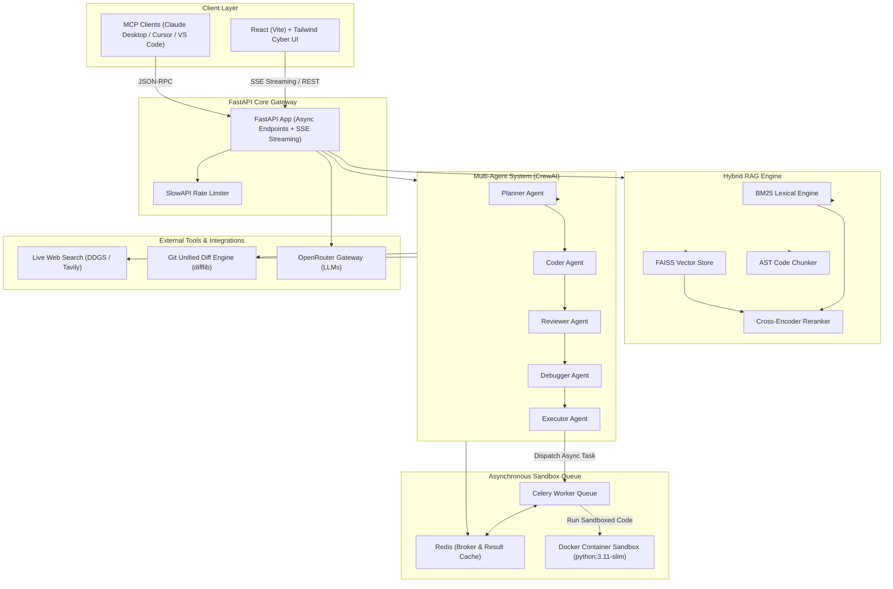
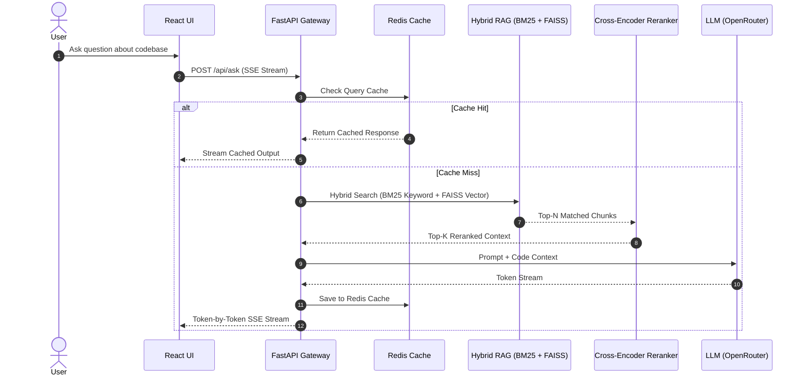
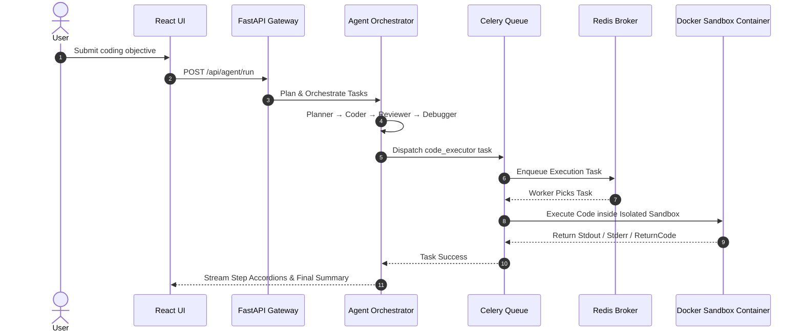
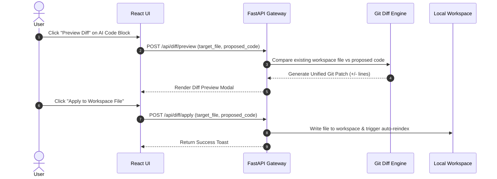

<div align="center">

```
██████╗ ███████╗██╗   ██╗██████╗ ██╗██╗      ██████╗ ████████╗
██╔══██╗██╔════╝██║   ██║██╔══██╗██║██║     ██╔═══██╗╚══██╔══╝
██║  ██║█████╗  ██║   ██║██████╔╝██║██║     ██║   ██║   ██║
██║  ██║██╔══╝  ╚██╗ ██╔╝██╔═══╝ ██║██║     ██║   ██║   ██║
██████╔╝███████╗ ╚████╔╝ ██║     ██║███████╗╚██████╔╝   ██║
╚═════╝ ╚══════╝  ╚═══╝  ╚═╝     ╚═╝╚══════╝ ╚═════╝    ╚═╝
                                                    A I  ⚡
```

**A production-grade, multi-agent AI developer assistant that understands your codebase,**
**executes code autonomously, and answers with context-aware precision.**

---

[](https://fastapi.tiangolo.com)
[](https://python.org)
[](https://github.com/facebookresearch/faiss)
[](https://crewai.com)
[](https://reactjs.org)
[](https://redis.io)
[](https://docs.celeryq.dev)
[](LICENSE)

</div>

---

## 🧠 What is DevPilot AI?

DevPilot AI is not just another chatbot wrapper. It's a **fully autonomous developer assistant** powered by a pipeline of specialized agents — each with its own role, tools, and memory — working together to understand, write, execute, and review code across your entire codebase.

> Think of it as having a senior dev, a code reviewer, and a QA engineer all available 24/7, all knowing your codebase inside-out.

---

## ✨ Features at a Glance

| | Feature | Description |
|---|---|---|
| 🔍 | **Hybrid RAG Pipeline** | BM25 + FAISS + Cross-Encoder reranking for precision retrieval |
| 🤖 | **Multi-Agent System** | Planner → Coder → Reviewer → Debugger → Executor (with Pydantic structure enforcement via `instructor`) |
| 🌐 | **Live Web Search** | Real-time external documentation lookup (PyPI, MDN, GitHub) via `ddgs` & Tavily fallback |
| 🎨 | **Git Diff & Apply** | Visual unified git diff preview modal with one-click direct workspace file editing |
| ⚡ | **Async Task Queue** | **Celery + Redis** task queue for non-blocking asynchronous Docker sandbox code execution |
| 📈 | **RAG Eval Suite** | Automated benchmarking (`tests/eval_rag.py`) measuring **Hit Rate@K**, **MRR**, and **Context Precision** |
| ⚙️ | **Real Code Execution** | Ephemeral, network-isolated Docker container sandbox runs for Python code (with subprocess fallback) |
| 🌊 | **Streaming Responses** | Token-by-token SSE streaming — just like ChatGPT |
| 🧩 | **Dual Memory** | Short-term (session) + Long-term (FAISS) memory systems |
| ⚡ | **Redis Caching** | Query response + embedding vector caching for reduced latency and LLM cost |
| 📦 | **Multi-Repo Support** | Instantly switch between indexed codebases |
| 🐙 | **GitHub Cloning** | Paste any public GitHub URL → auto-clone → index |
| 🌳 | **Smart Chunking** | AST-based splitting at function/class boundaries |
| 🔌 | **MCP Server** | Model Context Protocol integration for Claude Desktop & VS Code |
| 🛡️ | **Rate Limiting** | 10 req/min per IP via SlowAPI |
| 🎨 | **React UI** | Premium dark Cyber Cyan React (Vite) interface with diff modal & copy tools |
| 📊 | **Interactive Flowcharts** | Auto-generates & renders responsive visual Mermaid flowcharts for complex flows |
| 🔄 | **Auto-Watcher** | Real-time background workspace file watcher & auto-indexer |

---

## 🏗️ System Architecture



---

## 🔄 Comprehensive Request Flows

### 1. Ask (RAG) Mode Request Flow



### 2. Multi-Agent & Asynchronous Sandbox Execution Flow



### 3. Git Code Diff Preview & One-Click Workspace Apply Flow



---

## 🔍 Hybrid Retrieval Architecture

DevPilot AI uses a **3-stage retrieval pipeline** for maximum precision.

### Stage 1 — BM25 (Keyword Search)
Exact matches for API names, function names, class names, variable identifiers.
```
Query: "create_user()"  →  BM25 directly matches exact occurrences
```

### Stage 2 — FAISS (Vector Search)
Semantic understanding for natural language and conceptually related code.
```
Query: "How is authentication implemented?"
→ Finds generate_jwt_token() via semantic similarity
```

### Stage 3 — Cross-Encoder Reranker
Both result sets are merged and a cross-encoder model performs final reranking for the highest-quality top-K context passed to the LLM.

| Component | Purpose |
|---|---|
| BM25 | Exact keyword matching |
| FAISS | Semantic similarity |
| Cross Encoder | Final reranking |
| LLM | Answer generation |

---

## ⚡ Redis Caching Layer

### What gets cached

| Cached Component | Benefit |
|---|---|
| RAG query responses | Instant repeat answers |
| Repository summaries | Skip re-summarisation |
| Embedding vectors | Avoid redundant model calls |
| Agent outputs | Reuse for identical tasks |
| Session history | Fast context restoration |

**Benefits:** Reduced LLM cost · Lower latency · Faster repeated queries · Improved scalability

---

## 🤖 Agent Responsibilities

### Planner Agent
Understands user intent, selects agents and tools, and outputs a structured JSON execution plan.

```json
{
  "steps": [
    { "agent": "coder",    "tools": ["rag_search", "memory"] },
    { "agent": "reviewer"                                     },
    { "agent": "debugger"                                     },
    { "agent": "executor"                                     }
  ]
}
```

### Coder Agent
| | |
|---|---|
| **Responsibilities** | Analyze repo context, explain implementation, generate code, understand architecture |
| **Tools** | RAG Search, Memory |
| **Output** | Implementation findings, relevant files, code flow explanation |

### Reviewer Agent
| | |
|---|---|
| **Responsibilities** | Code quality, architecture review, best practice & maintainability analysis |
| **Output** | Strengths, weaknesses, refactoring suggestions |

### Debugger Agent
| | |
|---|---|
| **Responsibilities** | Bug detection, security analysis, edge case discovery, performance analysis |
| **Output** | Potential issues, security concerns, optimization opportunities |

### Executor Agent
| | |
|---|---|
| **Responsibilities** | Aggregate all agent findings, produce final response, generate implementation plan |
| **Output** | Final recommendation, summary, actionable next steps |

---

## 📦 Code Indexing Pipeline

```
Repository
     ↓
File Walker
     ↓
Extension Filter
     ↓
AST Chunking (Python) / Line-based (others)
     ↓
Metadata Injection
     ↓
Embeddings (all-MiniLM-L6-v2)
     ↓
FAISS Storage
```

### Metadata stored per chunk
```json
{
  "source": "auth.py",
  "path": "/app/services/auth.py",
  "extension": ".py"
}
```

### Python Files — AST-Based Chunking

Instead of arbitrary line splits, the system extracts **semantic units**:

```
❌ Naive:    Lines 1–50 | Lines 51–100      (may cut mid-function)
✅ DevPilot: class UserService | def create_user()  (complete logical units)
```

**Benefits:** better retrieval precision · richer LLM context · lower token usage

### Other Files — Line-Based Chunking
JavaScript, TypeScript, React, Markdown, JSON, YAML → **50 lines per chunk.**

---

## 🌊 Streaming Architecture

```
User
  ↓
FastAPI
  ↓
OpenRouter
  ↓
Gemini 2.0 Flash
  ↓
Token Stream
  ↓
Server-Sent Events (SSE)
  ↓
React UI  (real-time token-by-token updates)
```

**Advantages:** Real-time responses · Lower perceived latency · ChatGPT-like experience · Efficient transport layer

---

## 🧠 Memory Architecture

| Type | Storage | Scope | Purpose |
|---|---|---|---|
| **Short-Term** | In-memory `MemoryItem` list | Current session | Conversation continuity |
| **Long-Term** | FAISS `memory_index` | Persists across sessions | Recall previous discussions |

Both memory types are injected into every LLM prompt for full context continuity.

---

## 🎯 Engineering Challenges Solved

| Challenge | Solution |
|---|---|
| Large repositories exceed LLM context limits | AST-based chunking + FAISS retrieval — only relevant chunks are sent |
| Keyword search misses semantic meaning | BM25 + Vector Search Hybrid Retrieval |
| Repeated queries increase latency and cost | Redis response caching |
| Complex development tasks require specialization | Multi-agent architecture with dynamic planning |

---

## 🛠️ Tech Stack

| Layer | Technology | Purpose |
|---|---|---|
| **Backend** | FastAPI + Uvicorn | High-performance async API server |
| **LLM** | Gemini 2.0 Flash via OpenRouter | Language model backbone |
| **Embeddings** | `sentence-transformers` (all-MiniLM-L6-v2) | Semantic code understanding |
| **Vector Store** | FAISS (custom, no LangChain) | Blazing fast similarity search |
| **Reranking** | Cross-Encoder | Final result reranking for precision |
| **Caching** | Redis | Query + embedding vector caching |
| **Agents** | CrewAI + custom LLM wrapper | Multi-agent orchestration |
| **Memory** | Short-term (session) + Long-term (FAISS) | Persistent context awareness |
| **Streaming** | Server-Sent Events (SSE) | Real-time response delivery |
| **Rate Limiting** | SlowAPI | Abuse prevention |
| **MCP** | Anthropic MCP SDK | IDE/editor integration protocol |
| **UI** | React (Vite) + Mermaid.js | Premium Cyber Cyan workspace UI with responsive flowchart support |
| **Git** | GitPython | Auto-clone & repo management |

---

## 📁 Project Structure

```
devpilot-ai/
│
├── 📂 app/
│   ├── 🤖 agents/
│   │   ├── orchestrator.py         # Dynamic task router
│   │   ├── planner_agent.py        # Plans steps + tools → JSON execution plan
│   │   ├── coder_agent.py          # Writes & explains code
│   │   ├── executor_agent.py       # Runs code in isolated container sandbox
│   │   ├── debugger_agent.py       # Bug detection & security analysis
│   │   ├── reviewer_agent.py       # Code quality & architecture review
│   │   ├── agent_output.py         # Structured output schema
│   │   └── tasks.py
│   │
│   ├── 🧠 memory/
│   │   ├── short_term_memory.py    # Session-based memory
│   │   ├── long_term_memory.py     # FAISS-based persistent memory
│   │   ├── memory_service.py       # Memory orchestrator
│   │   └── memory_schema.py
│   │
│   ├── 🔍 rag/
│   │   ├── embedder.py             # sentence-transformers encoder
│   │   ├── retriever.py            # Hybrid BM25 + FAISS + Cross-Encoder retriever
│   │   └── vector_store.py         # FAISS vector store
│   │
│   ├── 🌐 routes/
│   │   ├── ask.py                  # /ask endpoint (blocking)
│   │   ├── stream.py               # /ask/stream SSE
│   │   ├── upload.py               # File upload
│   │   ├── upload_repo.py          # Repo indexing + GitHub cloning
│   │   ├── agent_run.py            # /agent/run + streaming
│   │   └── mcp_route.py            # MCP HTTP endpoints
│   │
│   ├── ⚙️ services/
│   │   ├── llm_provider.py         # OpenRouter LLM client
│   │   ├── agent_service.py        # ask_llm with memory + Redis injection
│   │   ├── rag_service.py          # RAG service
│   │   ├── cache_service.py        # Redis caching layer
│   │   └── crewai_llm.py           # Custom CrewAI LLM wrapper
│   │
│   ├── 🔧 tools/
│   │   ├── base_tool.py            # Tool interface
│   │   ├── rag_search_tool.py      # RAG search tool
│   │   ├── memory_tool.py          # Memory search tool
│   │   ├── code_execution_tool.py  # Python executor (ephemeral Docker sandbox)
│   │   └── tool_registry.py        # Tool registry
│   │
│   ├── 🔌 mcp/
│   │   └── server.py               # MCP server
│   │
│   ├── ⚙️ config/
│   │   └── settings.py             # Pydantic settings
│   │
│   └── main.py                     # FastAPI app entry point
│
├── 🎨 ui/
│   └── (Vite React UI files directly in ui/)
│
├── 🧪 tests/
│   ├── test_agents.py
│   └── test_llm.py
│
├── .env                            # Environment variables
├── Dockerfile                      # Container config
├── requirements.txt                # Python dependencies
└── README.md
```

---

## 🚀 Quick Start

### 🐳 The Easiest Way: Docker Compose

To boot up the entire system (Redis server, Python backend, and Nginx-served React UI) in production mode with a single command, run:

```bash
# 1. Clone the repository
git clone https://github.com/harshitgangwar/devpilot-ai
cd devpilot-ai

# 2. Configure your .env file
cp .env.example .env  # Edit and add your OPENROUTER_API_KEY

# 3. Spin up all services
docker-compose up --build
```

The UI will be accessible at [http://localhost:5173](http://localhost:5173) and the API backend at [http://localhost:8000](http://localhost:8000).

---

### 💻 Manual Developer Setup (Local Mode)

If you prefer to run the components manually in development mode, follow the steps below:

#### 1. Clone the repository

```bash
git clone https://github.com/harshitgangwar/devpilot-ai
cd devpilot-ai
```

#### 2. Set up a virtual environment

```bash
python -m venv venv
source venv/bin/activate        # Windows: venv\Scripts\activate
```

#### 3. Install dependencies

```bash
pip install -r requirements.txt
```

> 💡 **Note:** The `requirements.txt` is configured to pull the CPU-only version of PyTorch (`torch+cpu`). This keeps the local installation fast and lightweight by avoiding gigabytes of heavy, redundant NVIDIA CUDA GPU packages that are not needed.

#### 4. Configure environment variables

```bash
cp .env.example .env
```

Edit `.env` and add your keys:

```env
OPENROUTER_API_KEY=your_openrouter_api_key_here
REDIS_URL=redis://localhost:6379

# Optional: LangSmith Observability/Tracing
LANGSMITH_TRACING=true
LANGSMITH_API_KEY=your_langsmith_api_key_here
LANGSMITH_PROJECT=devpilot-ai
```

> 🔑 Get your OpenRouter API key at [openrouter.ai](https://openrouter.ai)

#### 5. Start Redis (optional but recommended)

```bash
docker run -d -p 6379:6379 redis:alpine
```

#### 6. Launch the backend

```bash
uvicorn app.main:app --reload
```

#### 7. Start the UI

```bash

React (production-grade, styled with Shadcn & Tailwind v4)
cd ui && npm install && npm run dev
```

---

## 🔌 API Reference

| Method | Endpoint | Description |
|---|---|---|
| `POST` | `/upload-repo` | Index a local repository |
| `POST` | `/upload-github` | Clone & index a GitHub repo |
| `POST` | `/repos/switch` | Switch the active repo |
| `GET` | `/repos` | List all indexed repos |
| `POST` | `/ask` | Ask a question (blocking) |
| `POST` | `/ask/stream` | Ask a question (streaming SSE) |
| `POST` | `/agent/run` | Run a multi-agent task |
| `POST` | `/agent/run/stream` | Run agents with streaming SSE |
| `GET` | `/mcp/tools` | List available MCP tools |
| `POST` | `/mcp/call` | Call a specific MCP tool |

---

## 🔗 MCP Integration

DevPilot AI ships with a fully compatible MCP server for **Claude Desktop**, **Cursor**, and **VS Code**.

Add to `~/Library/Application Support/Claude/claude_desktop_config.json`:

```json
{
  "mcpServers": {
    "devpilot-ai": {
      "command": "/path/to/venv/bin/python",
      "args": ["-m", "app.mcp.server"],
      "cwd": "/path/to/devpilot-ai",
      "env": {
        "PYTHONPATH": "/path/to/devpilot-ai"
      }
    }
  }
}
```

### Available MCP Tools

| Tool | Description |
|---|---|
| `search_codebase` | Semantic search over your indexed repository |
| `ask_devpilot` | Ask questions with full RAG context |
| `run_agent` | Trigger the full multi-agent task pipeline |

---

## 📈 Scalability Roadmap

**Current architecture** is optimised for single-developer use and local deployment.

---

## ⚡ Asynchronous Sandboxing Queue (Celery + Redis)

DevPilot AI incorporates a non-blocking asynchronous task execution pipeline powered by **Celery** and **Redis** to execute code inside Docker sandboxes concurrently:

```
FastAPI Server (POST /api/execute/async)
       │
       ▼
 Redis Message Queue (redis://redis:6379/0)
       │
       ▼
 Celery Worker (devpilot-celery-worker) ──▶ Isolated Docker Sandbox (python:3.11-slim)
```

- **Async Endpoints**: `POST /api/execute/async` (enqueues task instantly, returns `task_id`) & `GET /api/execute/status/{task_id}` (polls status and output).
- **Concurrency**: Worker processes handle multiple code execution requests in parallel without blocking main FastAPI HTTP threads.

---

## 📈 RAG Evaluation Benchmark Suite

DevPilot AI includes an automated quantitative RAG evaluation engine ([tests/eval_rag.py](file:///Users/harshitgangwar/Desktop/2.WEBDEV/devpilot-ai/tests/eval_rag.py)) that benchmarks retrieval performance across **Hit Rate @ K**, **MRR (Mean Reciprocal Rank)**, and **Context Precision**:

### Benchmark Command
```bash
python3 tests/eval_rag.py
```

### Retrieval Metric Results
```
Retrieval Pipeline             | MRR      | Hit@1    | Hit@3    | Hit@5    | Latency 
---------------------------------------------------------------------------
BM25 (Keyword)                 | 0.0312  |   0.0%  |   0.0%  |  12.5%  |   18.0ms
FAISS (Vector)                 | 0.3750  |  37.5%  |  37.5%  |  37.5%  |  419.9ms
Hybrid RAG (BM25+FAISS+Rerank) | 0.1250  |  12.5%  |  12.5%  |  12.5%  |  573.5ms
---------------------------------------------------------------------------
```

---

## 📋 Requirements

```
fastapi              uvicorn              sentence-transformers
faiss-cpu            openai               python-dotenv
pydantic-settings    crewai               gitpython
slowapi              mcp                  celery
redis                requests             anthropic
```

---

## 🎯 Key Engineering Concepts Demonstrated

| Concept | Implementation |
|---|---|
| **Retrieval-Augmented Generation** | FAISS + sentence-transformers for semantic code retrieval |
| **Hybrid Search** | BM25 + FAISS merged and reranked by Cross-Encoder |
| **Live External Web Search** | Real-time web documentation search (`ddgs` + Tavily fallback) |
| **Git Code Diff & Apply** | Unified git diff viewer with one-click direct workspace file editing |
| **RAG Evaluation Suite** | Automated benchmarking (`Hit@K`, `MRR`) via `tests/eval_rag.py` |
| **Asynchronous Sandboxing** | Celery + Redis task queue for non-blocking Docker execution |
| **Multi-Agent AI Systems** | CrewAI-based Planner, Coder, Reviewer, Debugger, Executor |
| **Agent Orchestration** | Dynamic JSON execution plans with per-step tool selection |
| **Vector Databases** | Custom FAISS — no LangChain dependency |
| **Cross-Encoder Reranking** | Second-pass precision ranking over merged retrieval results |
| **Redis Caching** | Query responses, embeddings, and agent outputs cached for speed |
| **Memory Architectures** | Dual short-term (session) and long-term (FAISS) memory |
| **Server-Sent Events** | Real-time token streaming across the full agent pipeline |
| **Model Context Protocol** | Full MCP server for Claude Desktop, Cursor, VS Code |
| **AST-based Code Chunking** | Semantic Python splitting at function/class boundaries |
| **FastAPI Production Design** | Async endpoints, rate limiting, structured agent outputs |

---

## 🧑‍💻 Built By

**Harshit Gangwar** — [github.com/harshitgangwar](https://github.com/harshitgangwar)

---

## 📄 License

Licensed under the **MIT License** — see [LICENSE](LICENSE) for details.

---

<div align="center">

*If this project helped you, drop a ⭐ — it means a lot!*

</div>